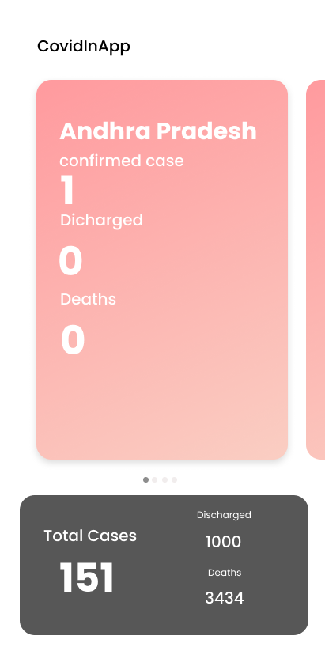

# CovidInApp
This App uses an api to feth data from a server.
Here I am demonstrating how to handle an API reaponse using Command line

## To run this app in your machine please follow along

1. Clone this repo on your desktop
2. enter in the folder that contain all the code and run <code>flutter create .<code/>
3. Then run <code>flutter run</code>

4. Then the app will run in your device in debug mode.

Fore more info please visit [Flutter Homepage](www.flutter.dev)

You can see the Design of the App here

